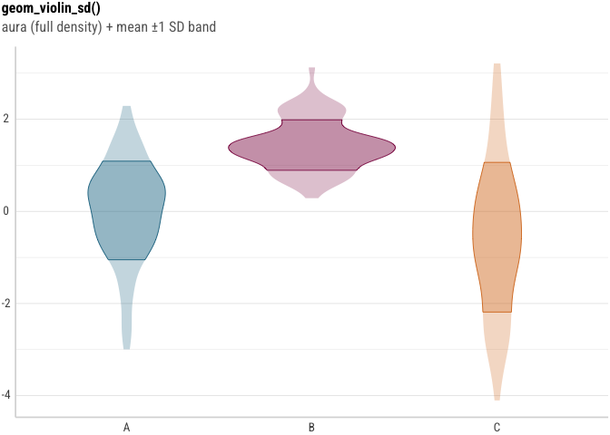
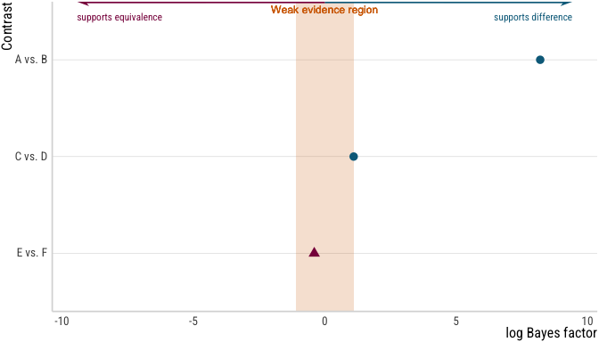

# emptyviz

<!-- badges: start -->

[](https://github.com/mkthalmann/emptyviz/actions/workflows/R-CMD-check.yaml)
<!-- badges: end -->

A `ggplot2` theme (`theme_mt()`) plus a set of composable geoms and plot
builders used across the author’s experimental projects: mean ± 1 SD
violin/half-violin/split-violin geoms for raw observations, and
`ggdist`-based halfeye/ridge/coefficient-grid, location-scale, and log
Bayes Factor forest plot builders for posterior draws from Bayesian
models (typically fit with `brms`).

This package is not intended for general audiences - it’s published so
that the specific analyses that depend on it are reproducible by anyone
who installs the tagged version they were built with.

## Installation

``` r
# install.packages("pak")
pak::pak("mkthalmann/emptyviz")
```

To pin the exact version a given analysis was built with (recommended
for reproducing a specific plot), install a tag or commit instead of the
default branch:

``` r
pak::pak("mkthalmann/emptyviz@v0.1.0")
```

`theme_mt()` defaults to the `"Roboto Condensed"` font family, which
this package does not install - it must already be available on the
system for text to render as intended. Most graphics devices fall back
to a different font silently rather than erroring, so a missing font
won’t be obvious; install it, or pass
`theme_mt(base_family = "")`/another available family, if reproducing a
plot’s exact appearance matters.

## Usage

``` r
library(emptyviz)
library(ggplot2)

# sets theme_mt() as the active ggplot2 theme
use_theme_mt()
```

``` r
set.seed(42)
demo_data <- rbind(
  data.frame(group = "A", value = rnorm(80, 0, 1)),
  data.frame(group = "B", value = rnorm(80, 1.5, 0.6)),
  data.frame(group = "C", value = rnorm(80, -0.5, 1.8))
)

ggplot(demo_data, aes(x = group, y = value, fill = group)) +
  geom_violin_sd() +
  labs(
    title = "geom_violin_sd()",
    subtitle = "aura (full density) + mean &plusmn;1 SD band",
    x = NULL, y = NULL
  ) +
  guides(fill = "none")
```



``` r
bf_data <- data.frame(
  contrast = c("A vs. B", "C vs. D", "E vs. F"),
  log_bf = c(8.2, 1.1, -0.4)
)

plot_bf_forest(
  bf_data,
  contrast = contrast,
  log_bf = log_bf,
  direction_labels = c("supports difference", "supports equivalence")
)
```



See `vignette("geoms-and-theme")` for the theme and the three `_sd`
violin geoms, and `vignette("bayesian-plots")` for the
halfeye/ridge/coefficient-grid, location-scale, and Bayes Factor forest
plot builders.

## Dark mode

`theme_mt(dark = TRUE)` is a dark-background variant - transparent
plot/panel background, light text/gridline colors, and `dark_mt_colors5`
in place of `mt_colors5` as the discrete palette - for a plot rendered
directly against a dark page. `theme_mt()`’s regular (`dark = FALSE`)
output is unaffected by this argument existing.

In a Quarto document, `use_theme_mt()` also registers automatic dual
light/dark figure rendering: set the `dual_render` chunk option to
`TRUE` (per chunk, or as a project-wide
`knitr: opts_chunk: dual_render: true` default) and every
`ggplot`/`patchwork` figure in that chunk renders twice - once normally,
once with the dark variant - wrapped for Quarto’s
`.light-content`/`.dark-content` toggle, so a light/dark theme-switching
site shows the right one without any client-side re-rendering. Chunks
that don’t set the option are unaffected.

## Development

``` r
devtools::load_all()
devtools::test()
devtools::check()
```
