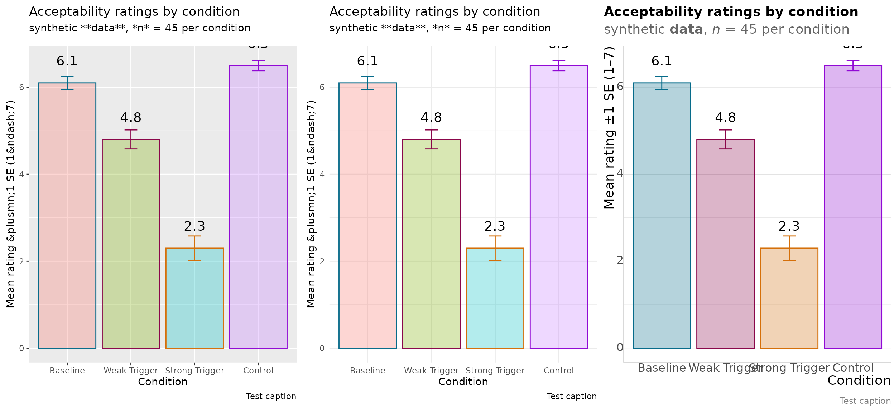
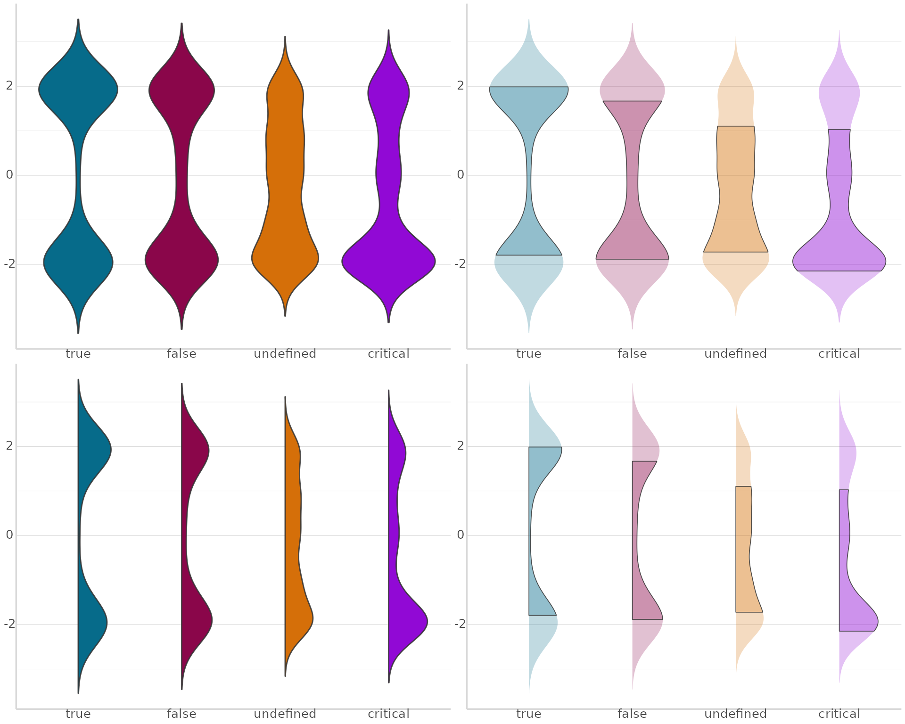
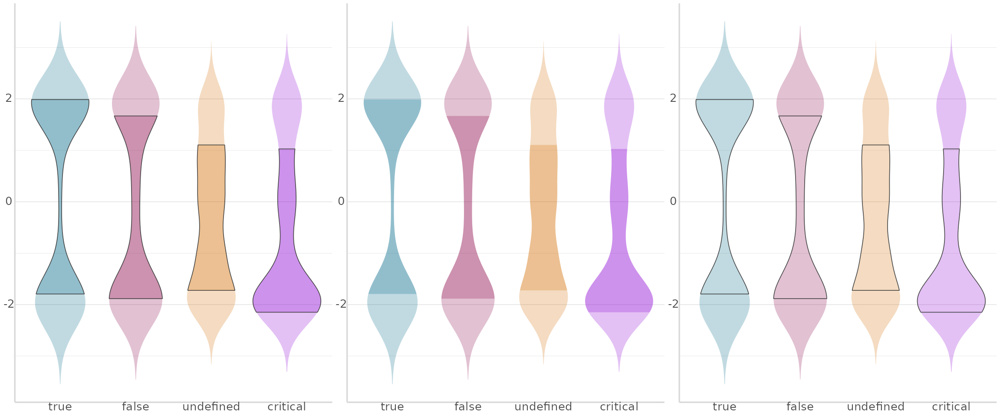
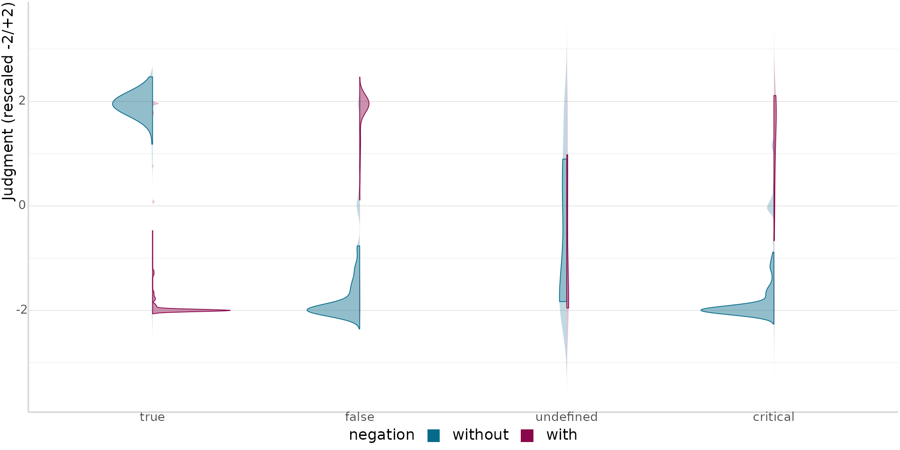
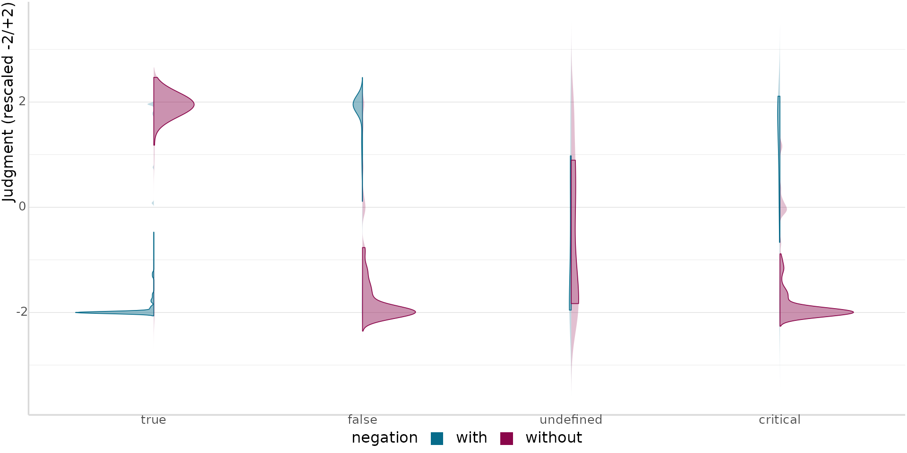
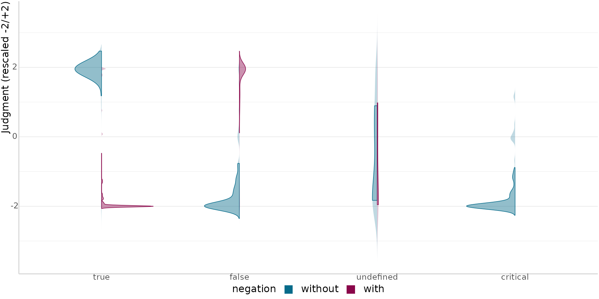
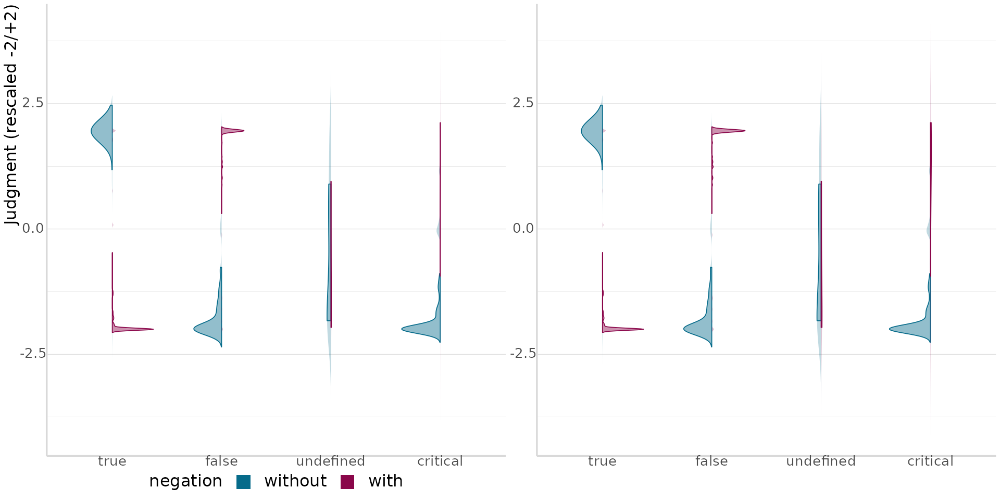

# theme_mt() and the SD-band violin geoms

``` r

library(emptyviz)
library(ggplot2)
library(dplyr)
library(forcats)
library(gghalves)
library(patchwork)
use_theme_mt()
```

## `believe_projection`

The demos below use `believe_projection`, truth-value judgment data from
Thalmann & Matticchio (2024) — a sentence-picture verification task
testing whether presuppositions triggered by *again*/*stop* under a
negated belief predicate (“Peter isn’t certain that Sonja stopped
smoking”) project universally or only relative to the attitude holder.
[`?believe_projection`](https://mkthalmann.github.io/emptyviz/reference/believe_projection.md)
has the full column reference; see
[`vignette("bayesian-plots")`](https://mkthalmann.github.io/emptyviz/articles/bayesian-plots.md)
for the actual distributional model fit to this data.

`sub_exp == "1"` restricts to the main judgment task (dropping training
and a separate world-knowledge norming block); the same three recodes
`believe-projection/scripts/belproj-paper.R` applies before modeling —
rescaling the 0-100 slider to a signed -2/+2 scale, expanding the
abbreviated `"undef"` scenario label, and markdown-italicizing `trigger`
so it renders nicely via
[`theme_mt()`](https://mkthalmann.github.io/emptyviz/reference/theme_mt.md)’s
markdown-aware axis text — are exactly what’s reused below and, later,
in
[`vignette("bayesian-plots")`](https://mkthalmann.github.io/emptyviz/articles/bayesian-plots.md).

``` r

d <- believe_projection |>
  filter(sub_exp == "1") |>
  mutate(
    judgment = (judgment - 50) / 25,
    scenario = gsub("undef", "undefined", scenario),
    scenario = factor(scenario, levels = c("true", "false", "undefined", "critical")),
    negation = factor(negation, levels = c("pos", "neg")),
    negation = fct_recode(negation, without = "pos", with = "neg"),
    trigger = paste0("*", trigger, "*"),
    trigger = factor(trigger, levels = c("*again*", "*stop*"))
  )
```

## `theme_mt()`

Extends
[`theme_minimal()`](https://ggplot2.tidyverse.org/reference/ggtheme.html)
with markdown/HTML-aware text (via `ggtext`), a bottom legend, and an
automatic discrete color palette. Same data/labels below, only the theme
differs:
[`theme_gray()`](https://ggplot2.tidyverse.org/reference/ggtheme.html),
[`theme_minimal()`](https://ggplot2.tidyverse.org/reference/ggtheme.html),
[`theme_mt()`](https://mkthalmann.github.io/emptyviz/reference/theme_mt.md).

``` r

# theme_mt()'s discrete palette and geom_text() font default are both
# theme-level settings that resolve once, from whichever theme is active
# when the plot's scale/geom defaults are first constructed - not from
# whatever theme ends up attached via `+ theme_X()` afterward. Since this
# vignette's global default is theme_mt() (set by use_theme_mt() above),
# the gray/minimal panels need an explicit scale_fill_hue()/family = "sans"
# to force ggplot2's real defaults instead of silently inheriting
# theme_mt()'s.
theme_compare_data <- data.frame(
  condition = c("Baseline", "Weak Trigger", "Strong Trigger", "Control"),
  mean_rating = c(6.1, 4.8, 2.3, 6.5),
  se = c(0.15, 0.22, 0.28, 0.12)
)
theme_compare_data$condition <- factor(
  theme_compare_data$condition,
  levels = theme_compare_data$condition
)

build_theme_compare_plot <- function() {
  ggplot(theme_compare_data, aes(x = condition, y = mean_rating, fill = condition, color = condition)) +
    geom_col(alpha = .3) +
    geom_errorbar(aes(ymin = mean_rating - se, ymax = mean_rating + se), width = 0.2) +
    labs(
      title = "Acceptability ratings by condition",
      subtitle = "synthetic **data**, *n* = 45 per condition",
      x = "Condition", y = "Mean rating &plusmn;1 SE (1&ndash;7)",
      caption = "Test caption"
    ) +
    guides(fill = "none", color = "none")
}

value_label <- function(...) {
  geom_text(
    aes(label = sprintf("%.1f", mean_rating)),
    vjust = -1.8, color = "black", size = 5,
    ...
  )
}

p_theme_gray <- build_theme_compare_plot() + theme_gray() + scale_fill_hue() + value_label(family = "sans")
p_theme_minimal <- build_theme_compare_plot() + theme_minimal() + scale_fill_hue() + value_label(family = "sans")
p_theme_mt <- build_theme_compare_plot() + theme_mt(base_size = 12) + value_label()

p_theme_gray + p_theme_minimal + p_theme_mt
```



## `geom_violin_sd()` / `geom_half_violin_sd()`

Compound layers built on
[`geom_violin()`](https://ggplot2.tidyverse.org/reference/geom_violin.html)/[`gghalves::geom_half_violin()`](https://rdrr.io/pkg/gghalves/man/geom_half_violin.html):
a low-alpha “aura” (full density) plus a solid mean ± 1 SD band on top.

Real truth-value judgments by `scenario` (collapsed across `negation`/
`trigger`) — floor/ceiling-heavy and asymmetric in a way
[`rnorm()`](https://rdrr.io/r/stats/Normal.html) samples never quite
are, which is exactly the case the “aura + SD-band” split is meant to
make legible.

``` r

demo_data <- d |> transmute(group = scenario, value = judgment)

violin_plain <- ggplot(demo_data, aes(x = group, y = value, fill = group)) +
  geom_violin(trim = FALSE) +
  labs(x = NULL, y = NULL) +
  guides(fill = "none")

violin_sd <- ggplot(demo_data, aes(x = group, y = value, fill = group)) +
  geom_violin_sd() +
  labs(x = NULL, y = NULL) +
  guides(fill = "none")

half_violin_plain <- ggplot(demo_data, aes(x = group, y = value, fill = group)) +
  geom_half_violin(side = "r", trim = FALSE) +
  labs(x = NULL, y = NULL) +
  guides(fill = "none")

half_violin_sd <- ggplot(demo_data, aes(x = group, y = value, fill = group)) +
  geom_half_violin_sd(side = "r") +
  labs(x = NULL, y = NULL) +
  guides(fill = "none")

(violin_plain + violin_sd) / (half_violin_plain + half_violin_sd)
```



### `style = "both"` / `"fill"` / `"outline"`

The SD band can be a solid fill, an outline, or both (default) — shared
by all three `_sd` geoms.

``` r

style_both <- ggplot(demo_data, aes(x = group, y = value, fill = group)) +
  geom_violin_sd(style = "both") +
  labs(x = NULL, y = NULL) +
  guides(fill = "none")

style_fill <- ggplot(demo_data, aes(x = group, y = value, fill = group)) +
  geom_violin_sd(style = "fill") +
  labs(x = NULL, y = NULL) +
  guides(fill = "none")

style_outline <- ggplot(demo_data, aes(x = group, y = value, fill = group)) +
  geom_violin_sd(style = "outline") +
  labs(x = NULL, y = NULL) +
  guides(fill = "none")

style_both + style_fill + style_outline
```



## `geom_split_violin_sd()`

Two
[`geom_half_violin_sd()`](https://mkthalmann.github.io/emptyviz/reference/geom_half_violin_sd.md)
halves back-to-back, one per level of `split` — no manual filtering or
`side = "l"`/`"r"` calls needed.

``` r

balanced_data <- d |> filter(trigger == "*again*")
split_mapping <- aes(x = scenario, y = judgment)
```

### Balanced

``` r

ggplot(balanced_data, split_mapping) +
  geom_split_violin_sd(split_mapping, data = balanced_data, split = negation) +
  labs(x = NULL, y = "Judgment (rescaled -2/+2)")
```



### `flip = TRUE`

Same data, sides swapped.

``` r

ggplot(balanced_data, split_mapping) +
  geom_split_violin_sd(split_mapping, data = balanced_data, split = negation, flip = TRUE) +
  labs(x = NULL, y = "Judgment (rescaled -2/+2)")
```



### Missing cell

Dropping `critical`/`with` entirely warns, not errors, and still renders
a lone half-violin.

``` r

missing_data <- balanced_data |>
  filter(!(scenario == "critical" & negation == "with"))

ggplot(missing_data, split_mapping) +
  geom_split_violin_sd(split_mapping, data = missing_data, split = negation) +
  labs(x = NULL, y = "Judgment (rescaled -2/+2)")
#> Warning: geom_split_violin_sd(): thin or one-sided x-levels - critical (missing
#> one side entirely)
```



### `scale = "count"` vs. `"area"`

`scale` only normalizes a side against itself, not against the other
side —
[`geom_split_violin_sd()`](https://mkthalmann.github.io/emptyviz/reference/geom_split_violin_sd.md)’s
two sides are separate `Stat` computations, so `scale` can only compare
an x-level against *its own side’s* other x-levels, never against the
other side’s counts. The real cells above are all ~100 trials, so the
effect needs an example: subsampling `with` down across `scenario`
(holding `without` fixed) engineers the imbalance while keeping every
plotted judgment a real trial, rather than fabricating ratings —
`"count"` (left, default) lets the shrinking `with` N narrow that side’s
violin; `"area"` (right) hides it entirely.

``` r

set.seed(42)
with_fracs <- c(true = 1, false = .7, undefined = .45, critical = .25)
unbalanced_data <- bind_rows(
  balanced_data |> filter(negation == "without"),
  balanced_data |>
    filter(negation == "with") |>
    group_by(scenario) |>
    group_modify(~ slice_sample(.x, prop = with_fracs[[as.character(.y$scenario)]])) |>
    ungroup()
)

p_scale_count <- ggplot(unbalanced_data, split_mapping) +
  geom_split_violin_sd(split_mapping, data = unbalanced_data, split = negation) +
  labs(x = NULL, y = "Judgment (rescaled -2/+2)")

p_scale_area <- ggplot(unbalanced_data, split_mapping) +
  geom_split_violin_sd(
    split_mapping,
    data = unbalanced_data, split = negation, scale = "area"
  ) +
  labs(x = NULL, y = NULL) +
  guides(fill = "none")

p_scale_count + p_scale_area
```


